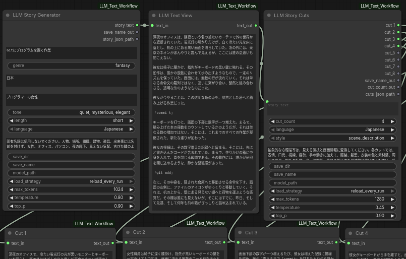

# ComfyUI-LLM-Text-Workflow

ComfyUI 用のローカル LLM テキストワークフローです。  
ローカルの `.gguf` モデルを直接読み込み、物語生成、カット分割、タグ化、動画プロンプト化、モデル別プロンプト変換、歌詞生成、キャラクター生成、髪型生成、服装生成、簡易翻訳までを ComfyUI 上でまとめて扱えます。



## インストール

1. `ComfyUI/custom_nodes` に移動します。

2. このリポジトリを `git clone` します。

```bash
cd /path/to/ComfyUI/custom_nodes
git clone https://github.com/jkmq-f/ComfyUI-LLM-Text-Workflow.git
cd ComfyUI-LLM-Text-Workflow
python -m pip install -r requirements.txt
```

3. ComfyUI を再起動します。

## 必要環境

- ComfyUI
- Python 環境
- `llama-cpp-python`
- ローカルの `.gguf` モデル

## モデルパス

`model_path` には、ローカルの `.gguf` モデルファイルのフルパスを指定してください。

例:

```text
/home/yourname/models/your-model.gguf
```

## クイックスタート

基本的な流れは以下です。

1. **LLM Story Generator** を追加
2. `story_text` を生成
3. `story_text` を **LLM Story Cuts** へ接続
4. `cut_count` を設定して `cut_1` ～ `cut_8` を生成
5. 必要に応じて **LLM Story Tags** で物語全体のタグを生成
6. 必要に応じて **LLM Cut Tags** でカットごとのタグを生成
7. **LLM Video Prompt** でカットごとの動画プロンプトを生成
8. 必要に応じて **LLM Prompt Converter** / **LLM Prompt Converter 8** でモデル別プロンプトへ変換

推奨の接続例:

```text
Story -> Story Cuts -> Video Prompt
     \-> Story Tags
     \-> Cut Tags
     \-> Prompt Converter
```

追加ワークフロー例:

```text
Story -> Story To Lyrics
Character Generator -> Hair Generator -> Outfit Generator -> Outfit Color -> Outfit Texture
Any Text -> Simple Translate
```

## ノード一覧

### 1. LLM Story Generator

シンプルな入力項目から物語を書くノードです。

**入力**
- `idea`
- `genre`
- `setting`
- `protagonist`
- `tone`
- `length`
- `language`
- `extra_requirements`
- `save_dir`
- `save_name`
- `model_path`
- `load_strategy`
- `max_tokens`
- `temperature`
- `top_p`

**出力**
- `story_text`
- `save_name_out`
- `story_json_path`

不足している情報があっても、自然に補いながら直接物語を書きます。

---

### 2. LLM Story Cuts

物語を複数の連続カットに分割するノードです。

**入力**
- `story_text`
- `cut_count`
- `language`
- `style`
- `extra_requirements`
- `save_dir`
- `save_name`
- `model_path`
- `load_strategy`
- `max_tokens`
- `temperature`
- `top_p`

**出力**
- `cut_1`
- `cut_2`
- `cut_3`
- `cut_4`
- `cut_5`
- `cut_6`
- `cut_7`
- `cut_8`
- `save_name_out`
- `cut_count_out`
- `cuts_json_path`

`cut_count` で生成するカット数を決めます。未使用の出力は空のままになります。

**`style` の選択肢**
- `scene_description`
- `video_prompt`
- `cinematic_video_prompt`
- `shot_prompt_dense`
- `simple_beat_sheet`

---

### 3. LLM Story Tags

物語全体を 1 行のタグ列へ変換するノードです。

**入力**
- `story_text`
- `tag_mode`
- `language`
- `max_tags`
- `extra_requirements`
- `save_dir`
- `save_name`
- `model_path`
- `load_strategy`
- `max_tokens`
- `temperature`
- `top_p`

**出力**
- `tags_text`
- `save_name_out`
- `tags_json_path`

**`tag_mode` の選択肢**
- `general_keywords`
- `image_prompt_tags`
- `video_prompt_tags`
- `character_tags`

---

### 3a. LLM Cut Tags

各カットを個別のタグ列に変換するノードです。

**入力**
- `cut_1` ～ `cut_8`
- `cut_count`
- `tag_mode`
- `language`
- `max_tags_per_cut`
- `extra_requirements`
- `save_dir`
- `save_name`
- `model_path`
- `load_strategy`
- `max_tokens`
- `temperature`
- `top_p`

**出力**
- `tag_1` ～ `tag_8`
- `all_cut_tags`
- `save_name_out`
- `cut_count_out`
- `cut_tags_json_path`

物語全体ではなく、カットごとのタグが欲しい時に使います。

---

### 4. LLM Video Prompt

各カットを動画用プロンプトへ変換するノードです。

**入力**
- `cut_1`
- `cut_2`
- `cut_3`
- `cut_4`
- `cut_5`
- `cut_6`
- `cut_7`
- `cut_8`
- `cut_count`
- `language`
- `prompt_style`
- `extra_requirements`
- `save_dir`
- `save_name`
- `model_path`
- `load_strategy`
- `max_tokens`
- `temperature`
- `top_p`

**出力**
- `prompt_1`
- `prompt_2`
- `prompt_3`
- `prompt_4`
- `prompt_5`
- `prompt_6`
- `prompt_7`
- `prompt_8`
- `all_prompts`
- `save_name_out`
- `cut_count_out`
- `video_prompts_json_path`

**`prompt_style` の選択肢**
- `cinematic_video_prompt`
- `shot_prompt_dense`
- `simple_visual_prompt`
- `sora_like`
- `ltx_like`

---

### 5. LLM Prompt Converter

物語やカットを、特定モデル向けのプロンプトに変換するノードです。

**入力**
- `input_text`
- `input_type`
- `mode`
- `language`
- `max_tags`
- `extra_requirements`
- `save_dir`
- `save_name`
- `model_path`
- `load_strategy`
- `max_tokens`
- `temperature`
- `top_p`

**出力**
- `selected_output`
- `save_name_out`
- `prompt_json_path`

**`mode` の選択肢**
- `Illustrious`
- `Z-Image`
- `Anima`

モデル別のプロンプト変換を 1 ノードで行いたい時に使います。

---

### 5a. LLM Prompt Converter 8

複数の入力テキストをまとめて、特定モデル向けのプロンプトへ変換するノードです。

**入力**
- `input_1` ～ `input_8`
- `input_count`
- `input_type`
- `mode`
- `language`
- `max_tags`
- `extra_requirements`
- `save_dir`
- `save_name`
- `model_path`
- `load_strategy`
- `max_tokens`
- `temperature`
- `top_p`

**出力**
- `output_1` ～ `output_8`
- `all_outputs`
- `save_name_out`
- `prompt_json_path`

複数カットをまとめて画像向けタグやモデル別プロンプトへ変換したい時に使います。

---

### 6. LLM Character Generator

キャラクター設定をまとめて生成するノードです。  
性別、年齢、性格、服装、髪型、職業、外見、雰囲気、話し方などを入力し、1 キャラクター分のまとまった設定文と JSON を出力します。

**入力**
- `gender`
- `age`
- `personality`
- `clothing`
- `hairstyle`
- `occupation`
- `appearance`
- `atmosphere`
- `speech_style`
- `world_type`
- `extra_requirements`
- `language`
- `save_dir`
- `save_name`
- `model_path`
- `load_strategy`
- `max_tokens`
- `temperature`
- `top_p`

**出力**
- `character_text`
- `character_json`
- `save_name_out`
- `character_json_path`

未入力の項目は無理に埋めず、入力された条件を中心に自然なキャラクター像へ整理します。

---

### 7. LLM Random Persona Speech

ランダムな人格コアを作るノードです。  
性格と話し方の核だけを軽量に作りたい時に向いています。

**入力**
- `seed`
- `language`
- `extra_requirements`
- `save_dir`
- `save_name`
- `model_path`
- `load_strategy`
- `max_tokens`
- `temperature`
- `top_p`

**出力**
- `personality`
- `speech_style`
- `save_name_out`
- `persona_json_path`

キャラクター全文設定を作る前段として使うこともできます。

---

### 8. LLM Hair Generator

髪型文を生成するノードです。  
キャラクター文や任意の補助テキストをもとに、髪の長さ、質感、前髪、結び方、色などを整理し、単体の髪設定として出力します。

**入力**
- `character_text`
- `gender`
- `age`
- `hair_length`
- `hair_texture`
- `bangs`
- `tied_or_untied`
- `hair_color_mode`
- `hair_color`
- `extra_requirements`
- `language`
- `save_dir`
- `save_name`
- `model_path`
- `load_strategy`
- `max_tokens`
- `temperature`
- `top_p`

**出力**
- `hair_text`
- `hair_json`
- `save_name_out`
- `hair_json_path`

髪型だけを独立して詰めたい時に使います。  
ランダム生成と固定指定を混ぜられるため、たとえば「長さだけ指定して、質感と前髪はランダム」のような使い方ができます。

**主な特徴**
- 髪の長さ、質感、前髪、結び方を個別に制御
- ヘアカラーを固定指定またはランダム化
- キャラクター文の雰囲気を参照して髪型文を補強
- キャラクターノードから髪を分離して、再利用しやすい構成にできる

推奨例:

```text
Character Generator -> Hair Generator
```

または

```text
Character Generator -> Hair Generator -> Outfit Generator
```

---

### 9. LLM Outfit Generator

服装案を生成するノードです。  
性別、季節、スタイル、職業、年齢帯、気分、靴、靴下、アウター条件などから、実用寄りにも創作寄りにも服装を組み立てられます。

**入力**
- `gender_mode`
- `gender`
- `season_mode`
- `season`
- `style_mode`
- `style`
- `profession_mode_select`
- `profession`
- `mood`
- `age_range`
- `avoid_items`
- `outerwear_mode`
- `outerwear_type`
- `socks_mode`
- `shoe_mode`
- `include_shoes`
- `shoe_type`
- `shoe_avoid`
- `randomness`
- `detail_strength`
- `seed`
- `language`
- `save_dir`
- `save_name`
- `model_path`
- `load_strategy`
- `max_tokens`
- `temperature`
- `top_p`

**出力**
- `outfit_text`
- `outfit_json`
- `save_name_out`
- `outfit_json_path`

ランダム生成と入力指定を混ぜられるのが特徴です。  
たとえば「季節は固定、職業だけランダム」のような使い方ができます。

---

### 10. LLM Outfit Color

既存の服装文に配色情報を加えるノードです。

**入力**
- `outfit_text`
- `language`
- `palette_mode`
- `color_strength`
- `model_path`
- `load_strategy`
- `max_tokens`
- `temperature`
- `top_p`
- `save_dir`
- `save_name`
- `custom_hint`（任意）

**出力**
- `colored_outfit_text`
- `color_summary`
- `color_tags`

**`palette_mode` の選択肢**
- `neutral`
- `warm`
- `cool`
- `muted`
- `earth`
- `monotone`
- `high_contrast`
- `auto`

服の種類を変えず、配色方針だけを足したい時に使います。

---

### 11. LLM Outfit Texture

既存の服装文に素材感や表面感を加えるノードです。  
色ではなく、編み地、光沢、厚み、乾いた質感、滑らかさなどの情報を補います。

**入力**
- `outfit_text`
- `language`
- `material_focus`
- `surface_condition`
- `texture_strength`
- `model_path`
- `load_strategy`
- `max_tokens`
- `temperature`
- `top_p`
- `save_dir`
- `save_name`
- `custom_hint`（任意）

**出力**
- `textured_outfit_text`
- `texture_summary`
- `material_tags`

服装文の解像度を上げたい時に、`LLM Outfit Color` の後段へつなぐ構成が使いやすいです。

推奨例:

```text
Outfit Generator -> Outfit Color -> Outfit Texture
```

---

### 12. LLM Story To Lyrics

物語や設定文から、歌詞とセクション時間を生成するノードです。  
歌える形を優先し、単なるあらすじ列挙になりにくいように設計されています。

**入力**
- `story_text`
- `target_duration_sec`
- `language`
- `song_structure`
- `syllable_density`
- `theme_focus`
- `include_section_labels`
- `section_label_style`
- `extra_requirements`
- `save_dir`
- `save_name`
- `model_path`
- `load_strategy`
- `max_tokens`
- `temperature`
- `top_p`

**出力**
- `lyrics_text`
- `timing_text`
- `total_duration_sec`
- `save_name_out`
- `lyrics_json_path`

**`song_structure` の選択肢**
- `short_hook_loop`
- `verse_chorus`
- `verse_verse_chorus`
- `verse_chorus_verse_chorus`
- `verse_chorus_bridge`
- `verse_prechorus_chorus`
- `verse_prechorus_chorus_outro`
- `intro_verse_prechorus_chorus`
- `intro_verse_chorus_verse_chorus_bridge_final`
- `full_jpop`
- `hook_verse_hook`
- `spoken_verse_chorus`
- `ambient_intro_verse_drop_outro`
- `free`

**`section_label_style` の選択肢**
- `internal_keys`
- `bracket_pretty`
- `ace_suno`

`ace_suno` を使うと、`[verse_1]` や `[chorus]` のような形で出しやすく、ACE-Step や Suno 向けの下書きとして扱いやすくなります。

---

### 13. LLM Simple Translate

シンプルな翻訳ノードです。  
長いワークフローを挟まず、単体テキストを軽く翻訳したい時に使います。

**入力**
- `input_text`
- `source_language`
- `target_language`
- `model_path`
- `load_strategy`
- `max_tokens`
- `temperature`
- `top_p`

**出力**
- `translated_text`

`source_language` は自動判定にも対応しています。

## 保存機能

すべての主要ノードは `save_dir` と `save_name` に対応しています。

- `save_dir`: `.json` や `.txt` を保存するフォルダ
- `save_name`: 共通のプロジェクト名。空欄の場合は自動生成
- `save_name_out`: 次ノードへ渡すための確定済み保存名

### 保存名のつなぎ方

`save_name_out` は、次ノードの `save_name` にそのままつないでください。  
この保存名は **すでに確定済みの名前** として扱われ、後段ノードで再度タイムスタンプを付け直さない仕様です。

そのため、たとえば `LLM Story Generator` の `save_name_out` を `LLM Prompt Converter` の `save_name` へつないだ場合でも、親名は崩れません。

例:

```text
20260416_001212_story_story.txt
20260416_001212_story_story.json
20260416_001212_story_prompt.txt
20260416_001212_story_prompt.json
```

### 対応ノード

保存名の連鎖処理は、以下のノードで共通化されています。

- `LLMStoryNode`
- `LLMStoryCutsNode`
- `LLMCutTagsNode`
- `LLMStoryTagsNode`
- `LLMPromptConverter`
- `LLMPromptConverter8`
- `LLMVideoPromptNode`
- `LLMCharacterGeneratorNode`
- `LLMHairGeneratorNode`
- `LLMRandomPersonaSpeechNode`
- `LLMOutfitGeneratorNode`
- `LLMStoryToLyricsNode`

### 主な保存系出力

- `LLM Story Generator` → `save_name_out`, `story_json_path`
- `LLM Story Cuts` → `save_name_out`, `cut_count_out`, `cuts_json_path`
- `LLM Story Tags` → `save_name_out`, `tags_json_path`
- `LLM Cut Tags` → `save_name_out`, `cut_count_out`, `cut_tags_json_path`
- `LLM Video Prompt` → `save_name_out`, `cut_count_out`, `video_prompts_json_path`
- `LLM Prompt Converter` → `save_name_out`, `prompt_json_path`
- `LLM Prompt Converter 8` → `save_name_out`, `prompt_json_path`
- `LLM Character Generator` → `save_name_out`, `character_json_path`
- `LLM Hair Generator` → `save_name_out`, `hair_json_path`
- `LLM Random Persona Speech` → `save_name_out`, `persona_json_path`
- `LLM Outfit Generator` → `save_name_out`, `outfit_json_path`
- `LLM Story To Lyrics` → `save_name_out`, `lyrics_json_path`

### 推奨のつなぎ方

- Story の `save_name_out` → Cuts の `save_name`
- Story の `save_name_out` → Tags の `save_name`
- Story の `save_name_out` → Video Prompt の `save_name`
- Story の `save_name_out` → Prompt Converter の `save_name`
- Story の `save_name_out` → Prompt Converter 8 の `save_name`
- Story の `save_name_out` → Story To Lyrics の `save_name`
- Cuts の `cut_count_out` → Video Prompt の `cut_count`

キャラクター系の例:

```text
Character Generator -> Hair Generator -> Outfit Generator -> Outfit Color -> Outfit Texture
```

## 表示ノード

### LLM Text View
1 つのテキストを表示する確認用ノードです。  
物語本文、1 カット、タグ 1 行、単体プロンプトの確認に向いています。

### LLM Text View 8
8 個のテキストをまとめて表示する確認用ノードです。  
`cut_1` ～ `cut_8` や `tag_1` ～ `tag_8` の確認に向いています。

### 表示ノードの注意
- `LLM Text View` と `LLM Text View 8` は `js/text_view.js` のフロントエンド拡張を使います。
- カスタムノードを入れた後は、ComfyUI の再起動とブラウザの再読み込みを行ってください。
- 実行後、表示テキストはノード内に出ます。

## 保存ノード

### LLM Save Text
1 本のテキストを `txt` / `md` / `json` で保存するノードです。

### LLM Save Text 8
最大 8 本のテキストをまとめて保存するノードです。  
複数カットや複数タグの一括保存に向いています。

歌詞の保存例:

- `lyrics_text` を `LLM Save Text` へ接続して `.txt` 保存
- `timing_text` を別名で保存
- もしくは `lyrics_json_path` を参照して JSON をそのまま利用

## メモ

- このワークフローは `llama-cpp-python` を使用します。
- `reload_every_run` を使うと、実行ごとにメモリを解放します。
- `<end_of_turn>` のような停止マーカーは出力から取り除かれます。
- `keep_loaded` は再ロード回数を減らせますが、VRAM / RAM に余裕がない環境では不安定になることがあります。
- `LLM Story To Lyrics` はセクションごとの秒数を内部で再配分します。
- `section_label_style = ace_suno` と `include_section_labels = true` を使うと、歌詞生成後の整形が楽です。
- `LLM Outfit Color` と `LLM Outfit Texture` は服の種類を変えるためのノードではなく、既存の服装文を補強するノードです。
- `LLM Hair Generator` はキャラクター設定から髪を分離して再利用したい時に向いています。
